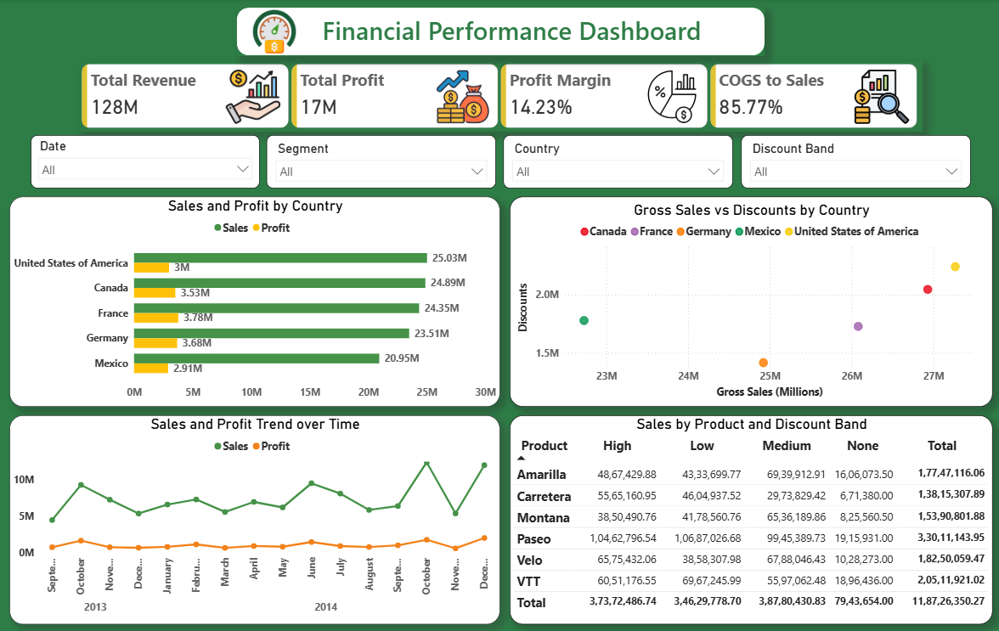

# 📊 Financial Performance Dashboard

## 📌 Project Overview

This project focuses on analyzing financial performance across different countries, products, discount bands, and time periods using Microsoft Power BI.

The objective is to transform raw financial data into meaningful insights through data cleaning, KPI development, DAX calculations, and interactive dashboard visualization.

## 🎯 Project Objectives

The goal of this Power BI project is to analyze financial performance across different countries, products, and time periods using key financial metrics such as Sales, Profit, Cost of Goods Sold (COGS), Gross Sales, and Discounts.

The dashboard helps evaluate profitability, identify trends, compare performance across countries, and generate meaningful business insights through interactive visualizations.

## 📌 Problem Statement

Given a financial dataset containing sales, profit, discounts, products, countries, segments, and time-based information, the task is to analyze overall financial performance using business intelligence techniques.

The analysis includes:

* Comparing Sales and Profit across countries
* Tracking Sales and Profit trends over time
* Evaluating the relationship between Gross Sales and Discounts
* Analyzing Sales performance across Discount Bands
* Monitoring key financial KPIs such as Revenue, Profit Margin, and COGS to Sales Ratio

## 📁 Dataset Information

The dataset contains:

* Segment
* Country
* Product
* Discount Band
* Units Sold
* Manufacturing Price
* Sale Price
* Gross Sales
* Discounts
* Sales
* COGS
* Profit
* Date
* Month Number
* Month Name
* Year

## 🛠 Tools & Technologies Used

* Microsoft Power BI
* Power Query (Data Cleaning & Transformation)
* DAX (Data Analysis Expressions)
* KPI Cards & Interactive Visualizations

## 🧹 Data Cleaning & Transformation

* Removed currency symbols ($)
* Removed commas from numeric values
* Replaced (-) values where applicable
* Cleaned Discount and Profit columns
* Corrected Date formatting
* Changed Month Number and Year to Whole Number
* Converted financial columns to Decimal Number
* Validated data quality and transformation errors

**Note:** The source dataset includes separate Date, Month Number, Month Name, and Year columns. Monthly analysis was conducted based on the Month Name and Year fields according to the dataset structure.

## 🧮 DAX Measures Created

* Total Revenue
* Total Profit
* Total Discounts
* Profit Margin
* COGS to Sales Ratio

## 📊 Key KPIs Developed

| KPI                    | Value  |
| ---------------------- | ------ |
| 💰 Total Revenue       | 128M   |
| 📈 Total Profit        | 17M    |
| 📊 Profit Margin       | 14.23% |
| 💼 COGS to Sales Ratio | 85.77% |

## 📈 Dashboard Features

📊 Sales and Profit by Country
* Compared financial performance across different countries.
* Visualization Used: Clustered Bar Chart
📈 Sales and Profit Trend Over Time
* Analyzed sales and profit trends across different time periods.
* Visualization Used: Line Chart
🔵 Gross Sales vs Discounts Analysis
* Examined the relationship between Gross Sales and Discounts across countries.
* Visualization Used: Scatter Plot
📋 Sales by Product and Discount Band
* Analyzed product performance across different discount bands.
* Visualization Used: Matrix Table
🎛 Interactive Analysis
* Added slicers for Date, Country, Segment, and Discount Band.
* Enabled cross-filtering across visuals for dynamic analysis.

## 📌 Key Insights

* 🌎 United States generated the highest sales revenue among the selected countries
* 📈 Sales remained significantly higher than profit across all countries
* 📊 Profit trends generally followed sales trends over time
* 🔗 The scatter plot provided insights into the relationship between Gross Sales and Discounts across countries.
* 🛒 Product performance varied across discount bands
* 🎯 Interactive filtering enables dynamic financial analysis

## 🚀 Learning Outcomes

* Applied Power Query for data cleaning and transformation
* Created DAX measures for financial KPI calculations
* Built an interactive Power BI dashboard
* Implemented slicers and cross-filtering functionality
* Performed financial performance analysis using business metrics
* Improved dashboard design and analytical storytelling skills

## 📌 Conclusion

This project demonstrates the practical application of Power BI in financial performance analysis. The dashboard provides valuable insights into sales, profitability, discounts, and business performance, enabling better data-driven decision-making.

## 📷 Dashboard Preview

